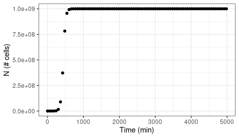
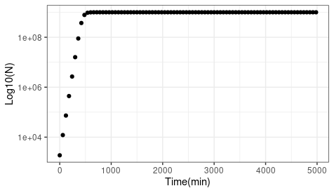
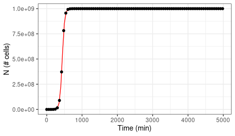
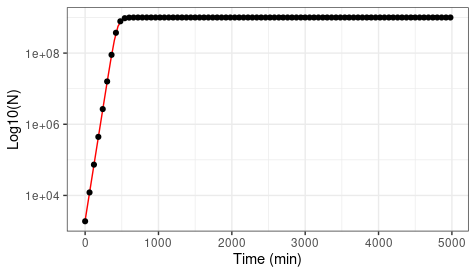
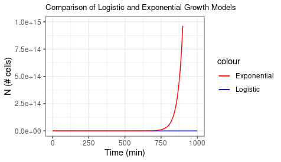
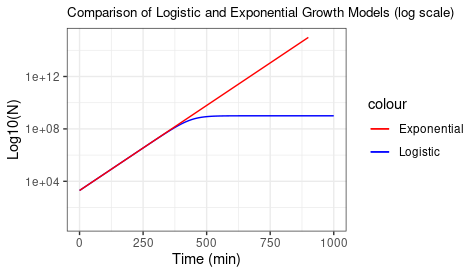

Logistic Growth Analysis

Using data from *Escherichia coli* in growth media, I want to estimate three values:

-   Initial population size: N0

-   Growth rate: r

-   Carrying capacity: K

To do this, I will first plot the data showing the number of cells over time.

I used data: experiment2.csv

[](/cloud/project/LogisticGrowthProject/N_cells_over_Time.png)

This plot shows how the population grows exponentially until resources are depleted and the population reaches a carrying capacity(K) at 1.000e+09 cells.

I can also show the data log transformed to show the linear growth:



This plot shows the linear growth of the cells at the start of the experiment when resources were high. And then the cells are constant once carrying capacity is reached.

To estimate N0, r and K we can use linear approximations.

When K is larger than N0 and t is small:

ln(N) = ln(N0) + rt

e.g. when t=400:

```{r}
data_subset1 <- growth_data %>% filter(t<400) %>% mutate(N_log = log(N))

model1 <- lm(N_log ~ t, data_subset1)
summary(model1)
```

This tells us an estimate of the Intercept=N0 is 7.59

It also tells us an estimate of r, which is the slope, of 0.029

To estimate K, we look at when t is high, and N is constant; we can use the following approximation:

N(t)=K+0.t

```{r}
data_subset2 <- growth_data %>% filter(t>1000)

model2 <- lm(N ~ 1, data_subset2)
summary(model2)
```

This tells us that K is 1.000e+09

We can use this information to plot the models on the data:





Question 2: Use estimates of N0 and r to calculate population size at t=4980 min, assuming that the population grows exponentially. How does it compare to the population size predicted under logistic growth?

My estimates were N0= 7.59 and r=0.029

Using the equation for a line which shows exponential growth:

$$
N(t)=N_0e^{rt} 
$$

```{r}
Nt<-N0*exp(r*t)
```

Population size at time 4980 minutes is

```         
9.294958e+67
```

Under the logistic growth models, the population size at t=4980 minutes has reached K, carrying capacity of 1.000e+09. Therefore, with exponential growth, the population has reached a much larger size than in logistic growth.

Question 3: Graph comparing exponential and logistic growth curves:

Using the same estimated growth rate and initial population size, I created the graphs below, showing both models' growth curves.




